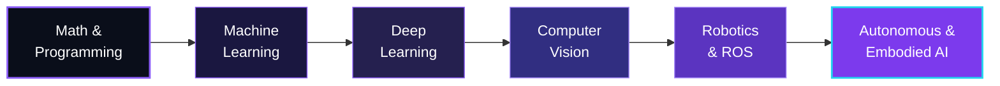

<!-- ============================================================
     GITHUB PROFILE README · Yeurekaaa (mydJhi07)
     Theme  : Synapse — Neural Violet → Cyan
     Accent : #8B5CF6   ·   Base: #0A0E1A   ·   Edge: #22D3EE
     Focus  : Artificial Intelligence · Robotics · Machine Learning
     ============================================================ -->

<!-- ======================== HEADER BANNER ======================== -->
<div align="center">
  
</div>

<!-- ======================== TYPING ANIMATION ======================== -->
<div align="center">
  <a href="https://github.com/mydJhi07">
    
  </a>
</div>

<!-- ======================== FOLLOWERS ======================== -->
<div align="center">
  <a href="https://github.com/mydJhi07?tab=followers">
    
  </a>
</div>

<div align="center">
  <a href="https://instagram.com/muhammad_ydha">
    
  </a>
  <a href="https://github.com/mydJhi07">
    
  </a>
</div>

<br/>

<!-- ======================== ABOUT ME ======================== -->
## 🚀 About Me


```python
class Kiyo:
    def __init__(self):
        self.name       = "Muhammad Yudha Damanhuri"
        self.role       = "Informatics Engineering Student"
        self.university = "Hasanuddin University (UNHAS)"
        self.semester   = 3
        self.location   = "Makassar, Indonesia"
        self.focus      = ["Artificial Intelligence",
                           "Robotics",
                           "Machine Learning",
                           "Data Structures & Algorithms"]
        self.languages  = ["Python", "C++", "C"]
        self.learning   = "Math & Code → ML → Deep Learning → Robotics"
        self.goals      = ["ONMIPA  (Mathematics)",
                           "GEMASTIK (ICT)",
                           "AI / Robotics Engineer / Researcher"]

    def say_hi(self):
        print("Thanks for visiting! Let's build something intelligent 🤖")
```

- 🔭 Sedang membangun fondasi kuat di **machine learning & robotics**
- 🌱 Belajar **Python, C++, C**, matematika & **deep learning** dari nol
- 🎯 Menargetkan kompetisi **ONMIPA** (matematika) & **GEMASTIK** (TIK)
- 🤖 Tertarik pada **computer vision, autonomous robots & intelligent systems**
- ⚡ Fun fact: aku suka mengajarkan mesin untuk **melihat, berpikir, dan bergerak**

<br clear="right"/>

---

<!-- ======================== TECH STACK ======================== -->
## 🛠️ Tech Stack & Tools

<table>
<tr>
<td valign="top" width="50%">

### 💻 Languages


### 🧠 AI & Machine Learning


### 🤖 Robotics


</td>
<td valign="top" width="50%">

### 📊 Data & Notebooks


### 🧰 Tools & Platforms


### 📝 Markup & Docs


</td>
</tr>
</table>

<div align="center">
  
</div>

---

<!-- ======================== AI & ROBOTICS ROADMAP ======================== -->
## 🧭 My AI & Robotics Roadmap

> Perjalanan multi-tahun dari near-zero menuju **AI & Robotics Engineer**



<div align="center">

| 🟢 Now | 🟡 Next | 🔵 Later |
|:------:|:-------:|:--------:|
| DSA & C/C++ mastery | Neural nets with PyTorch | Reinforcement learning |
| Python for ML | Computer vision (OpenCV) | Autonomous mobile robots |
| Linear algebra & calculus | ROS fundamentals | Edge AI on Jetson |

</div>

---

<!-- ======================== FEATURED PROJECTS ======================== -->
## 📌 Featured Projects

<div align="center">
  <i>🚧 Proyek pilihan (AI, Computer Vision & Robotics) akan segera tampil di sini.</i>
</div>

---

<!-- ======================== GITHUB ANALYTICS ======================== -->
## 📊 GitHub Analytics

<div align="center">
  
  
</div>

<div align="center">
  
</div>

---

<!-- ======================== TROPHIES ======================== -->
## 🏆 GitHub Trophies

<div align="center">
  
</div>

---

<!-- ======================== SNAKE ANIMATION ======================== -->
## 🐍 Contribution Snake

<div align="center">

<!-- Snake muncul setelah workflow .github/workflows/snake.yml berjalan minimal 1x -->
<picture>
  <source media="(prefers-color-scheme: dark)" srcset="https://raw.githubusercontent.com/mydJhi07/mydJhi07/output/github-snake-dark.svg" />
  <source media="(prefers-color-scheme: light)" srcset="https://raw.githubusercontent.com/mydJhi07/mydJhi07/output/github-snake.svg" />
  
</picture>

</div>

---

<!-- ======================== 2026 GOALS ======================== -->
## 🎯 2026 Goals

```text
🥇 [███░░░░░░░] Lolos & tampil di ONMIPA (Matematika)
🏅 [████░░░░░░] Berpartisipasi di GEMASTIK
🤖 [███░░░░░░░] Selesaikan 3 proyek AI/robotics end-to-end (data → model → deploy)
🧠 [█████░░░░░] Kuasai deep learning & computer vision
🌐 [████░░░░░░] Bangun portofolio AI & robotics yang solid
🤝 [██░░░░░░░░] Berkontribusi di proyek open source
```

---

<!-- ======================== DEV QUOTE ======================== -->
## 💭 Dev Quote of the Day

<div align="center">
  
</div>

---

<!-- ======================== CONNECT ======================== -->
## 🤝 Let's Connect

<div align="center">

Aku terbuka untuk **kolaborasi proyek**, **diskusi AI & robotics**, dan **belajar bareng**!

<a href="https://instagram.com/muhammad_ydha">
  
</a>
<a href="https://github.com/mydJhi07">
  
</a>

</div>

<!-- ======================== FOOTER ======================== -->
<div align="center">
  
</div>

<div align="center">
  <i>⭐ From <a href="https://github.com/mydJhi07">Yeurekaaa</a> — keep building, keep learning.</i>
</div>
